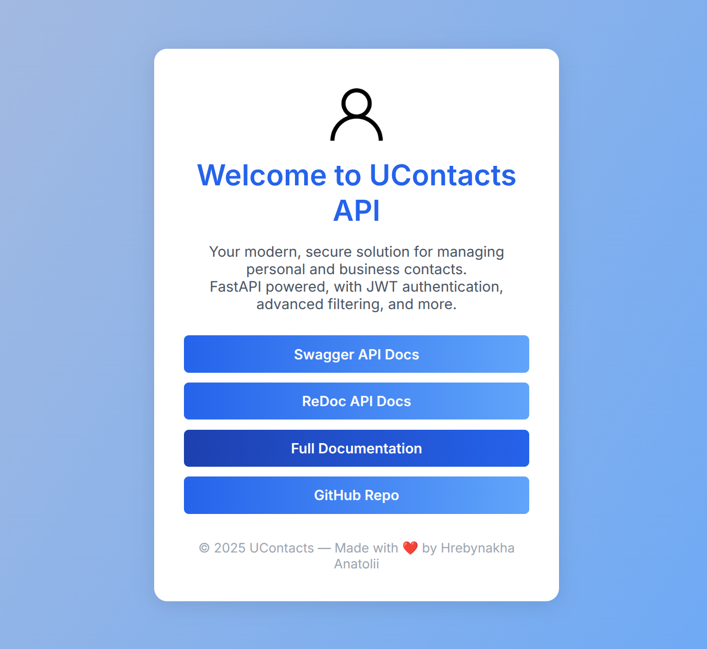

UContacts REST API Service documentation
================================================

The UContacts REST API Service is a application that provides a REST API for managing contacts. You can add, delete, update and get contacts.
UContacts porovide secure API for managing contacts.
All contacts are stored in the database, and reqire authentication for managing. User can manage only their contacts.

Demo Sites
----------
*  https://try.api.ucontacts.d0s.site

Contents
--------

.. toctree::
   :maxdepth: 2
   :caption: Getting Started

   quick-start
   configuration
   authentication
   authorization
   deployment

.. toctree::
   :maxdepth: 2
   :caption: API Reference

   api/reference
   api/query-syntax
   api/contact

.. toctree::
   :maxdepth: 2
   :caption: More

   about

